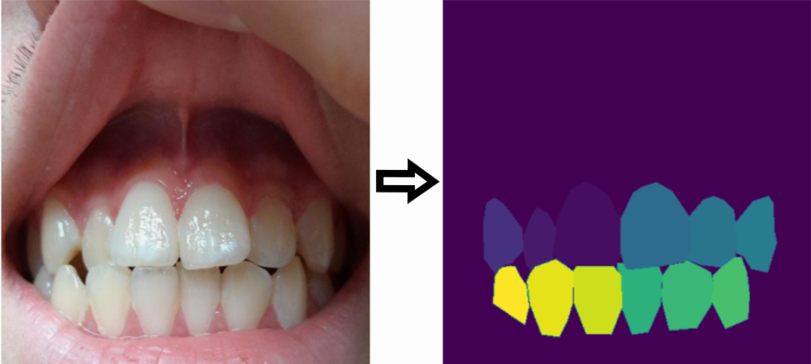

# Teeth-Numbering
#### *Predict the number of teeth( Semantic Segmentation model)*
## Table of Contents
* Introduction
* Dataset
* Model deployment
* Detection Results

#### Introduction
###### Currently, various projects are being created in the field of medicine with the help of semantic segmentation model. The tooth is the most painful organ of a person. Some of the AI models designed to predict dental diseases are considered to predict the number of teeth. Therefore, we created an AI model that predicts the number of teeth using a semantic segmentation model.This project uses the PyTorch framework. And the codes are written 100% in Jupyter Notebook.
#### Dataset
###### The training data for teeth numbering contains 14936 different teeth images in RGB format. Together with our team, the necessary tooth images were collected for the teeth numbering model. We organized various events with our team and attracted many people and had the opportunity to collect teeth images from them. 12 teeth images were taken from each participant.
###### Each image resized as 448x448 pixels. Annotation files were created by labeling the teeth in each image using the [Labelme](https://github.com/wkentaro/labelme) annotation tool.
###### Additionally, each image in the training dataset contains its corresponding mask image for teeth numbering. The mask is given as a PNG image where each label from 32 classes of labels is represented as positive integers with 0 as a background. A tooth image and corresponding mask from the training dataset is shown in Figure 1. 

 
 ###### Figure1. Orginal image and mask image

 
##### Author
- Jamoliddin Uraimov

##### For Contact.

- Twitter- [Jamoliddin Uraimov](https://twitter.com/Uraimov92cnu)
- LinkedIn- [Jamoliddin Uraimov](https://www.linkedin.com/in/jamoliddin-uraimov-0985b023b/)
